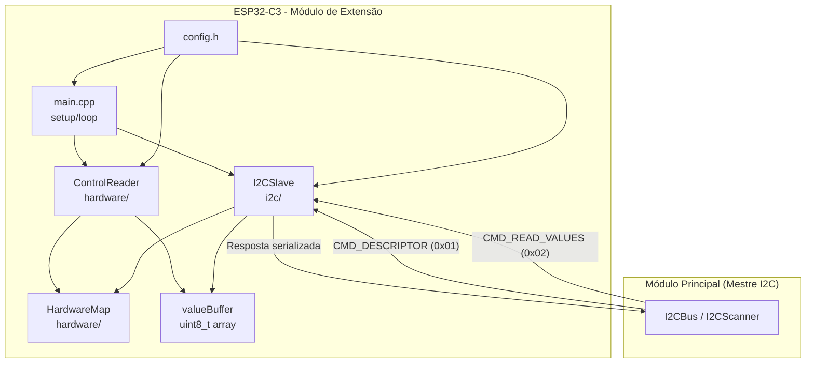
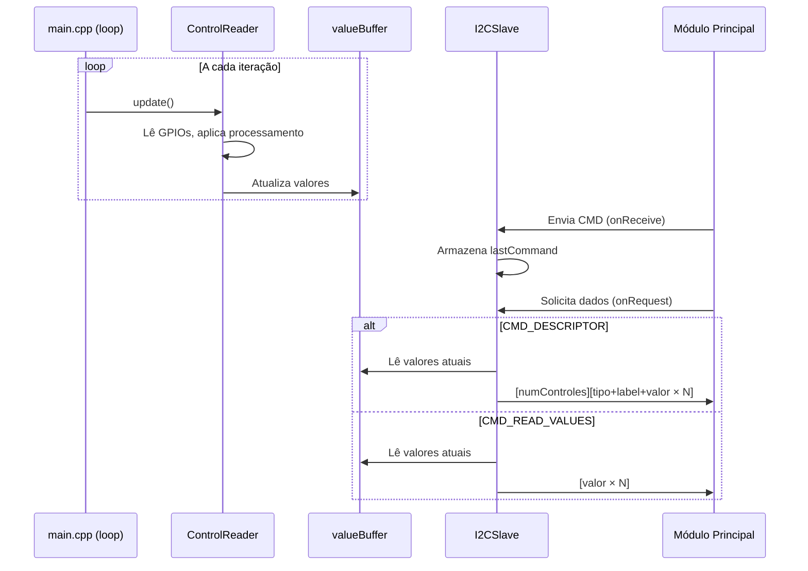

# Design Document

## Overview

Este documento descreve o design do firmware para o módulo de extensão I2C de um controlador MIDI modular. O firmware roda em um ESP32-C3 e opera exclusivamente como escravo I2C: lê controles de hardware (botões, potenciômetros, sensores, encoders) e serve os valores ao módulo principal sob demanda.

O design segue a mesma filosofia de organização do firmware principal — separação por responsabilidade em componentes — mas com escopo reduzido: sem display, sem MIDI direto, sem armazenamento.

### Decisões de Design

1. **Arduino Framework**: Mantém compatibilidade com o firmware principal e simplifica o uso da Wire library para I2C slave.
2. **Polling no loop()**: Leitura contínua de controles no loop principal (sem interrupções para ADC), garantindo que os valores estejam sempre atualizados quando o mestre solicitar.
3. **Buffer compartilhado com proteção**: Um array de valores é atualizado pelo loop e lido pelos callbacks I2C. Como o ESP32-C3 é single-core, não há race conditions entre o loop e os callbacks ISR da Wire, mas usamos `volatile` para garantir visibilidade.
4. **Encoder via polling com detecção de transição**: Encoders são lidos por polling dos pinos A/B a cada iteração, detectando transições de estado para determinar direção.

## Architecture



### Fluxo de Dados

1. **Loop principal**: `ControlReader::update()` lê todos os GPIOs, aplica processamento (deadzone, debounce, inversão, mapeamento) e atualiza o `valueBuffer`.
2. **Requisição I2C**: Quando o mestre envia um comando via `onReceive`, o módulo armazena o comando. No `onRequest`, responde com os dados apropriados lidos do `valueBuffer` e do `HardwareMap`.

### Estrutura de Diretórios

```
src/
├── main.cpp              # Entry point (setup/loop)
├── config.h              # Constantes globais do módulo
├── hardware/
│   ├── HardwareMap.h     # Mapeamento de GPIOs e controles
│   ├── ControlReader.h   # Interface do leitor de controles
│   └── ControlReader.cpp # Implementação da leitura
└── i2c/
    ├── I2CSlave.h        # Interface do escravo I2C
    └── I2CSlave.cpp      # Implementação dos callbacks
```

## Components and Interfaces

### config.h

```cpp
#pragma once

// Endereço I2C do módulo (faixa válida: 0x20-0x27)
constexpr uint8_t I2C_ADDRESS = 0x20;

// Nome do módulo
constexpr const char* MODULE_NAME = "EXT-01";

// Pinos I2C
constexpr uint8_t PIN_SDA = 8;
constexpr uint8_t PIN_SCL = 9;

// Parâmetros de leitura
constexpr uint8_t DEADZONE = 2;           // Tolerância para leituras analógicas (em unidades MIDI 0-127)
constexpr uint16_t DEBOUNCE_MS = 50;      // Tempo de debounce para botões (ms)

// Limites do protocolo
constexpr uint8_t MAX_CONTROLES = 16;

// Comandos I2C
constexpr uint8_t CMD_DESCRIPTOR = 0x01;
constexpr uint8_t CMD_READ_VALUES = 0x02;

// Constantes MIDI
constexpr uint8_t MIDI_MAX = 127;
constexpr uint8_t MIDI_MID = 64;

// ADC
constexpr uint16_t ADC_MAX = 4095;  // ESP32-C3: 12-bit ADC
```

### HardwareMap (hardware/HardwareMap.h)

```cpp
#pragma once
#include <cstdint>

enum class TipoControle : uint8_t {
    BOTAO = 0,
    POTENCIOMETRO = 1,
    SENSOR = 2,
    ENCODER = 3
};

struct ControleHW {
    const char* label;      // Max 12 caracteres
    uint8_t gpio;           // Pino principal (ou pino A para encoder)
    TipoControle tipo;
    uint8_t ccPadrao;
    bool invertido;
    uint8_t gpioB;          // Pino B para encoder (0 se não aplicável)
};

namespace HardwareMap {
    // Definido pelo usuário conforme o hardware montado
    constexpr ControleHW CONTROLES[] = {
        // {"Label", gpio, tipo, cc, invertido, gpioB}
        // Exemplo:
        // {"Pot1", 0, TipoControle::POTENCIOMETRO, 1, false, 0},
        // {"Btn1", 1, TipoControle::BOTAO, 2, false, 0},
        // {"Enc1", 2, TipoControle::ENCODER, 3, false, 3},
    };

    constexpr uint8_t NUM_CONTROLES = sizeof(CONTROLES) / sizeof(CONTROLES[0]);

    // Funções auxiliares
    constexpr const char* getLabel(uint8_t idx) { return CONTROLES[idx].label; }
    constexpr uint8_t getGpio(uint8_t idx) { return CONTROLES[idx].gpio; }
    constexpr TipoControle getTipo(uint8_t idx) { return CONTROLES[idx].tipo; }
    constexpr bool isInvertido(uint8_t idx) { return CONTROLES[idx].invertido; }
    constexpr bool isAnalogico(uint8_t idx) {
        return CONTROLES[idx].tipo == TipoControle::POTENCIOMETRO ||
               CONTROLES[idx].tipo == TipoControle::SENSOR;
    }
    constexpr uint8_t getGpioB(uint8_t idx) { return CONTROLES[idx].gpioB; }
}
```

### ControlReader (hardware/ControlReader.h)

```cpp
#pragma once
#include <cstdint>

namespace ControlReader {
    // Inicializa GPIOs conforme HardwareMap
    void init();

    // Lê todos os controles e atualiza o buffer
    void update();

    // Acesso ao buffer de valores (thread-safe para ISR context)
    const volatile uint8_t* getValues();
    uint8_t getValue(uint8_t index);
    uint8_t getNumControles();
}
```

### I2CSlave (i2c/I2CSlave.h)

```cpp
#pragma once
#include <cstdint>

namespace I2CSlave {
    // Inicializa Wire no modo escravo e registra callbacks
    void init();
}
```

### Interação entre Componentes



## Data Models

### Buffer de Valores

```cpp
// Array global volatile acessível por ControlReader e I2CSlave
volatile uint8_t valueBuffer[MAX_CONTROLES];
```

Cada posição corresponde a um controle na mesma ordem do `HardwareMap::CONTROLES[]`. Valores no intervalo 0-127 (MIDI).

### Estado Interno do ControlReader

```cpp
// Estado de debounce por botão
struct ButtonState {
    bool lastReading;       // Última leitura do pino
    bool stableState;       // Estado estável após debounce
    uint32_t lastChangeMs;  // Timestamp da última mudança
};

// Estado do encoder
struct EncoderState {
    uint8_t lastAB;         // Últimos estados dos pinos A e B (2 bits)
    uint8_t value;          // Valor acumulado (0-127, inicia em 64)
};

// Estado de deadzone para analógicos
struct AnalogState {
    uint8_t lastValue;      // Último valor MIDI enviado
};
```

### Protocolo I2C - Formato de Resposta

**CMD_DESCRIPTOR (0x01):**

| Offset | Tamanho | Conteúdo |
|--------|---------|----------|
| 0 | 1 byte | numControles |
| 1 | 14 bytes | Controle 0: tipo(1) + label(12) + valor(1) |
| 15 | 14 bytes | Controle 1: tipo(1) + label(12) + valor(1) |
| ... | ... | ... |

Total máximo: 1 + (14 × 16) = 225 bytes

**CMD_READ_VALUES (0x02):**

| Offset | Tamanho | Conteúdo |
|--------|---------|----------|
| 0 | 1 byte | Valor controle 0 |
| 1 | 1 byte | Valor controle 1 |
| ... | ... | ... |

Total: N bytes (N = numControles)

### Mapeamento ADC → MIDI

```
valor_midi = analogRead(gpio) * 127 / 4095
```

Com deadzone: só atualiza o buffer se `|novo_valor - ultimo_valor| > DEADZONE`

### Lógica de Inversão

- **Analógico invertido**: `127 - valor_midi`
- **Digital invertido**: `!leitura` (HIGH = 0, LOW = 127 ao invés de HIGH = 127, LOW = 0)

### Detecção de Encoder (Quadrature Decoding)

Tabela de transição simplificada usando os 2 bits [A,B]:

| Estado anterior | Estado atual | Ação |
|----------------|-------------|------|
| 00 | 01 | CW (+1) |
| 01 | 11 | CW (+1) |
| 11 | 10 | CW (+1) |
| 10 | 00 | CW (+1) |
| 00 | 10 | CCW (-1) |
| 10 | 11 | CCW (-1) |
| 11 | 01 | CCW (-1) |
| 01 | 00 | CCW (-1) |

## Correctness Properties

*A property is a characteristic or behavior that should hold true across all valid executions of a system — essentially, a formal statement about what the system should do. Properties serve as the bridge between human-readable specifications and machine-verifiable correctness guarantees.*

### Property 1: ADC to MIDI mapping preserves range and monotonicity

*For any* ADC value in the range [0, 4095], the mapped MIDI value SHALL be in [0, 127], and for any two ADC values a ≤ b, map(a) ≤ map(b) (monotonically non-decreasing).

**Validates: Requirements 3.4**

### Property 2: Deadzone filters noise below threshold

*For any* sequence of ADC readings for an analog control, the output MIDI value SHALL only change when the absolute difference between the new mapped value and the last emitted value exceeds the DEADZONE threshold.

**Validates: Requirements 3.2**

### Property 3: Debounce rejects unstable signals

*For any* sequence of button readings with timestamps, the debounced output SHALL only transition when the raw input has remained stable for at least DEBOUNCE_MS milliseconds.

**Validates: Requirements 3.3**

### Property 4: Inversion is self-inverse

*For any* MIDI value v in [0, 127], applying the inversion function twice SHALL return the original value: invert(invert(v)) == v. Additionally, invert(v) SHALL equal 127 - v.

**Validates: Requirements 3.5**

### Property 5: ModuleDescriptor serialization round-trip

*For any* valid set of controls (up to 16, each with tipo, label ≤ 12 chars, and value in [0, 127]), serializing to the ModuleDescriptor wire format and then deserializing SHALL recover the original control types, labels, and values.

**Validates: Requirements 4.2, 4.4, 4.6**

### Property 6: CMD_READ_VALUES response is identity over buffer

*For any* value buffer of N controls (each in [0, 127]), the CMD_READ_VALUES response SHALL be exactly N bytes where response[i] == buffer[i] for all i in [0, N).

**Validates: Requirements 4.3**

### Property 7: Encoder accumulation is bounded

*For any* sequence of encoder transitions (CW or CCW), the encoder value SHALL remain in [0, 127]. Starting from any value v, a CW step produces min(v + 1, 127) and a CCW step produces max(v - 1, 0).

**Validates: Requirements 7.2, 7.3**

## Error Handling

### Comandos I2C Desconhecidos

- Qualquer byte de comando diferente de `CMD_DESCRIPTOR` (0x01) e `CMD_READ_VALUES` (0x02) é silenciosamente ignorado.
- O `lastCommand` não é atualizado, e o próximo `onRequest` responde com base no último comando válido (ou não responde se nenhum comando válido foi recebido).

### Overflow de Buffer I2C

- A resposta do `CMD_DESCRIPTOR` pode ter até 225 bytes (1 + 14×16). O buffer da Wire library do ESP32 suporta até 128 bytes por padrão.
- **Mitigação**: Para módulos com mais de 9 controles, a resposta do descriptor excede 128 bytes. O design limita a resposta ao tamanho do buffer Wire (128 bytes) ou configura o buffer para 256 bytes via `Wire.setBufferSize(256)` na inicialização.

### Leituras ADC Fora de Faixa

- O ESP32-C3 ADC retorna valores de 12 bits (0-4095). Valores fora dessa faixa não ocorrem em hardware normal, mas o mapeamento usa divisão inteira que naturalmente limita o resultado a [0, 127].

### GPIO Inválido

- Se um GPIO configurado no HardwareMap não existir no ESP32-C3, o `pinMode` e `analogRead`/`digitalRead` terão comportamento indefinido do framework Arduino.
- **Mitigação**: Validação em tempo de compilação via `static_assert` nos GPIOs válidos do ESP32-C3 (0-10, 18-21 para ADC; 0-21 para digital).

### Encoder Bounce

- Transições inválidas na tabela de quadratura (ex: 00→11) são ignoradas — o valor do encoder não muda.

## Testing Strategy

### Abordagem Dual: Testes Unitários + Testes de Propriedade

O firmware será testado com duas abordagens complementares:

1. **Testes de Propriedade (PBT)**: Validam propriedades universais com 100+ iterações por propriedade, usando inputs gerados aleatoriamente.
2. **Testes Unitários**: Cobrem exemplos específicos, edge cases e integração entre componentes.

### Framework de Testes

- **PlatformIO native environment**: Testes rodam no host (não no ESP32) para velocidade.
- **Unity** (já incluído no PlatformIO): Framework de testes unitários.
- **Theft** ou **RapidCheck**: Biblioteca de property-based testing para C++.
  - **Escolha: RapidCheck** — integra bem com C++, suporta geradores customizados, e funciona no ambiente native do PlatformIO.

### Configuração PBT

- Mínimo 100 iterações por teste de propriedade
- Cada teste referencia a propriedade do design document
- Formato de tag: **Feature: midi-extension-firmware, Property {N}: {título}**

### Estrutura de Testes

```
test/
├── test_native/
│   ├── test_adc_mapping.cpp       # Property 1: ADC→MIDI mapping
│   ├── test_deadzone.cpp          # Property 2: Deadzone filtering
│   ├── test_debounce.cpp          # Property 3: Debounce stability
│   ├── test_inversion.cpp         # Property 4: Inversion self-inverse
│   ├── test_serialization.cpp     # Property 5: Descriptor round-trip
│   ├── test_read_values.cpp       # Property 6: CMD_READ_VALUES identity
│   └── test_encoder.cpp           # Property 7: Encoder bounded accumulation
└── test_embedded/
    └── test_integration.cpp       # Testes de integração no hardware real
```

### Separação de Lógica Testável

Para viabilizar PBT no host, as funções de processamento são implementadas como **funções puras** separadas do acesso a hardware:

- `uint8_t mapAdcToMidi(uint16_t adcValue)` — pura
- `bool applyDeadzone(uint8_t newValue, uint8_t lastValue, uint8_t deadzone)` — pura
- `bool applyDebounce(bool reading, bool lastStable, uint32_t lastChangeMs, uint32_t nowMs, uint16_t debounceMs)` — pura
- `uint8_t invertValue(uint8_t value)` — pura
- `void serializeDescriptor(const ControleHW* controls, const uint8_t* values, uint8_t count, uint8_t* outBuffer)` — pura
- `uint8_t processEncoderTransition(uint8_t lastAB, uint8_t currentAB, uint8_t currentValue)` — pura

### Testes Unitários (Exemplos e Edge Cases)

| Critério | Tipo | Descrição |
|----------|------|-----------|
| 2.3 | Example | NUM_CONTROLES == sizeof(CONTROLES)/sizeof(CONTROLES[0]) |
| 4.5 | Edge Case | Comando desconhecido não altera estado |
| 6.4 | Example | Buffer inicializado com zeros |
| 7.4 | Example | Encoder inicializa em 64 |
| 3.4 edge | Edge Case | ADC 0 → MIDI 0, ADC 4095 → MIDI 127 |
| 7.2 edge | Edge Case | Encoder em 127 + CW = 127 (não overflow) |
| 7.3 edge | Edge Case | Encoder em 0 + CCW = 0 (não underflow) |

### Testes de Integração (Hardware)

- Verificar que `ControlReader::init()` configura GPIOs corretamente
- Verificar que `I2CSlave::init()` registra callbacks
- Verificar comunicação I2C end-to-end com módulo principal (teste manual ou com segundo ESP32)
